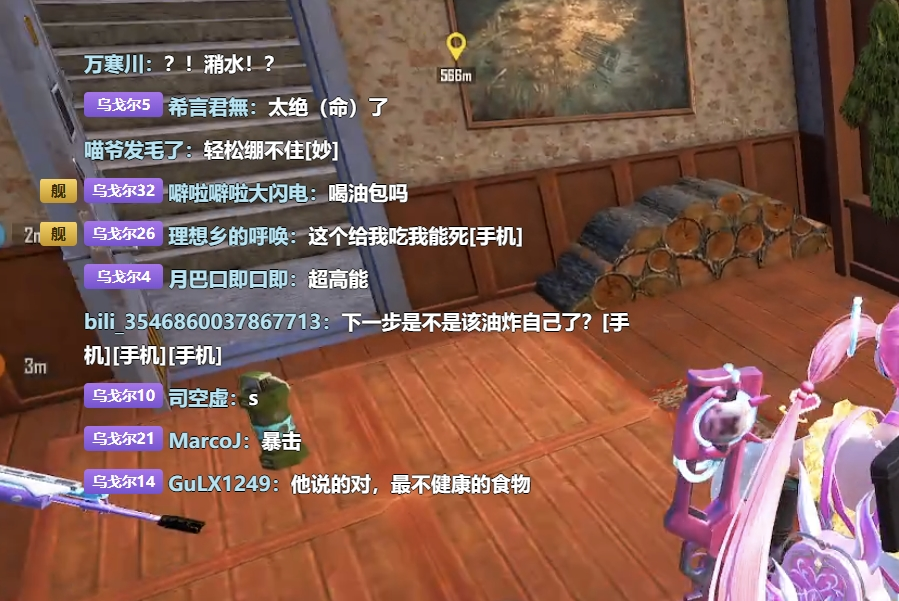
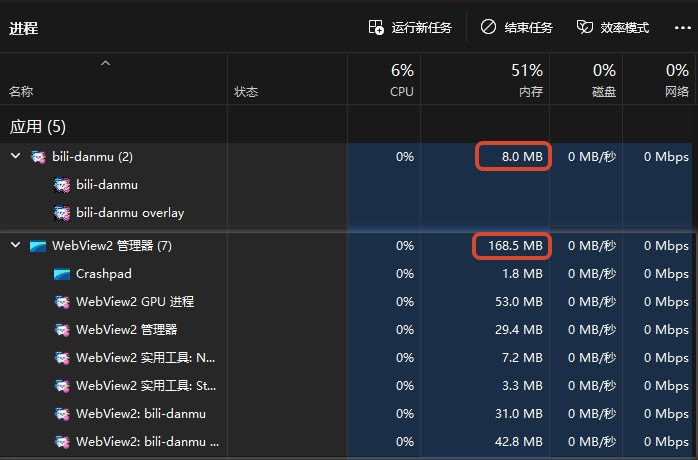

<p align="center"></p>

# bili-danmu

轻量级 B 站直播弹幕助手

> 连接 B 站直播间 → 获取实时弹幕 → 在桌面透明悬浮层显示（→ 弹幕朗读规划中）。

## 开发背景

- 以前在用的弹幕助手早已停更，B 站弹幕协议更新后已无法正常接收弹幕。
- 现存的弹幕助手基于臃肿的桌面框架，体积大、资源占用高，不够轻量。
- 因此重写本项目：给用 OBS 推流的主播一个不挡游戏画面的看弹幕窗口，也给想和主播一起玩、一起互动的水友一个干净的看弹幕工具。
- 感谢开源社区：弹幕协议相关接口的公开分析与实现，以及 [DanmuFree](https://github.com/SoraYjy/DanmuFree) 的开源参考。

## ✅ 已完成 vs 🔜 未完成

### B 站连接

| 功能 | 状态 |
|---|---|
| WebSocket 弹幕链路（认证包 protover=3、Brotli/Zlib 解压、DANMU_MSG 解析） | ✅ |
| WBI 签名 + getDanmuInfo（getConf 兜底）获取弹幕服务器 | ✅ |
| 30s 心跳保活 | ✅ |
| 扫码登录（二维码轮询 + Cookie 本地持久化 + 昵称显示） | ✅ |
| 游客自动降级（uid=0），无登录也可看弹幕 | ✅ |
| 断开自动重连（指数退避） | 🔜 未做 |
| 礼物/SC/舰队等事件解析 | 🔜 未做（V1 只处理普通弹幕，符合 PRD） |

<p align="center"></p>

### 弹幕显示（Overlay）

| 功能 | 状态 |
|---|---|
| 桌面透明悬浮层：透明背景、无边框、可置顶、可拖动、可调整大小 | ✅ |
| 鼠标穿透开关 | ✅ |
| 窗口位置/大小自动记忆，重启恢复 | ✅ |
| 弹幕样式：字号 / 字体族 / 用户名颜色 / 内容颜色 / 粗体 / 描边（颜色 + 宽度） | ✅ |
| 身份徽章独立开关：舰长 / 提督 / 总督 / 房管 / 粉丝牌 / 荣耀等级 | ✅ |
| 徽章排版对齐：固定身份前缀列，LV 徽章与换行续行各行同列对齐 | ✅ |
| 弹幕行间距可调（0–30px 滑块，实时生效并保存） | ✅ |
| 弹幕窗顶部透明拖拽条：鼠标移入即提示，弹幕高速刷新也能稳定拖动 | ✅ |
| 长文本弹幕换行与首行正文同列（不贴窗口左缘） | ✅ |
| 弹幕数量上限（120 条，超出移除最早）防内存无限增长 | ✅ |
| 滚动弹幕模式（右→左） | 🔜 未做（当前为列表流式） |
| 顶弹模式 | 🔜 未做 |
| 关键词 / 用户屏蔽过滤 | 🔜 未做 |
| 连接状态 / 系统提示行（与弹幕同字体同描边） | ✅ |

<p align="center"></p>

### TTS 朗读

| 功能 | 状态 |
|---|---|
| Windows 系统 TTS / Edge TTS 引擎 | 🔜 未做 |
| TTS 队列 + 队列长度限制（防刷屏） | 🔜 未做 |
| 语速 / 音量 / 音色选择 | 🔜 未做 |
| 朗读内容清洗（emoji / 超长文本 / 重复字符） | 🔜 未做 |

> 设置页「朗读」目前为占位页，整个 M5 里程碑尚未开工。

### 产品化

| 功能 | 状态 |
|---|---|
| 系统托盘（关闭隐藏主窗、左键唤出、右键菜单退出） | ✅ |
| 退出登录自动断开直播连接 | ✅ |
| 配置持久化（`%APPDATA%\com.bilidanmu.app\config.json`，JSON） | ✅ |
| 关于页：致谢弹幕协议 API 与 DanmuFree 开源参考 | ✅ |
| 单实例 | 🔜 未做 |
| 全局快捷键（显示/隐藏、TTS、穿透） | 🔜 未做 |
| 开机自启 / 启动自动连接上次房间 | 🔜 未做 |
| 统一日志系统 | 🔜 未做 |
| Release 打包验证（目标安装包 ≤ 30MB） | 🔜 未做 |

## 快速开始

环境要求：Node.js ≥ 20、pnpm、Rust toolchain（MSVC）、WebView2 Runtime（Win10/11 自带）。

```bash
pnpm install
pnpm tauri dev
```

启动后：

1. 扫码登录（可选，游客可直接看弹幕，登录后显示昵称）
2. 输入直播间号，点「连接」
3. 弹幕实时显示在桌面透明悬浮窗

## 技术栈

```text
Frontend   Vue 3 + TypeScript + Vite
Desktop    Tauri 2
Core       Rust（B 站协议 / WS / 登录 / 窗口控制 / 配置）
Platform   Windows（透明窗口、托盘）
```

- Rust 负责：B 站连接、WebSocket、协议解析、登录、窗口控制、配置持久化
- Vue 负责：设置界面（弹幕样式 / 弹幕窗控制）、悬浮窗弹幕渲染、状态展示

## 架构

```text
┌───────────────────────┐
│       Vue 3 UI        │  设置界面 / 悬浮窗渲染 / 状态
└──────────┬────────────┘
           │ Tauri IPC
┌──────────▼────────────┐
│      Rust Core        │
│  bilibili(WS 客户端)   │
│  config / overlay     │
└──────────┬────────────┘
           ▼
      Windows API
```

- 弹幕事件流：B 站 WS → Rust 解析 → `danmaku` 事件 → Vue Overlay 渲染
- 主窗口轮询 `get_connection_status` 兜底同步连接状态

## 配置与数据

- 配置目录：`%APPDATA%\com.bilidanmu.app\config.json`
- 保存内容：登录 Cookie（含昵称）、Overlay 弹幕样式与行距、Overlay 窗口位置/大小
- 数据仅存本机，不收集遥测、不上传日志

## 里程碑

| 里程碑 | 内容 | 状态 |
|---|---|---|
| M1 | Tauri + Vue + Rust 脚手架、IPC | ✅ |
| M2 | B 站弹幕链路（WS + WBI + 扫码登录） | ✅ |
| M3 | Overlay 悬浮窗（透明/穿透/置顶/拖动/记忆位置/拖拽条） | ✅ |
| M4 | 弹幕渲染 + 样式配置（字号/描边/行距）+ 数量限制 + 徽章对齐 | ✅ |
| 定制扩展 | 托盘 / 退出登录断连 / 桌面 logo | ✅ |
| 界面优化 | 弹幕页标签化、悬浮窗设置并入、昵称显示、关于页 | ✅ |
| M5 | TTS 朗读（引擎抽象 + 队列 + 清洗） | 🔜 未开始 |
| M6 | 自动重连 / 单实例 / 快捷键 / 日志 / 打包验证 | 🔜 部分 |

## 项目结构

```text
src/                    Vue 前端
├── views/              主窗页面（直播间 / 弹幕页（标签式）/ 关于 / 朗读占位）
├── overlay/            悬浮窗弹幕渲染（独立入口）
└── components/         登录二维码弹窗等

src-tauri/src/          Rust 核心
├── bilibili/           WS 客户端 / 封包协议 / 弹幕解析 / WBI / 登录
├── config.rs           配置读写
└── lib.rs              窗口控制、托盘、Tauri 命令
```


