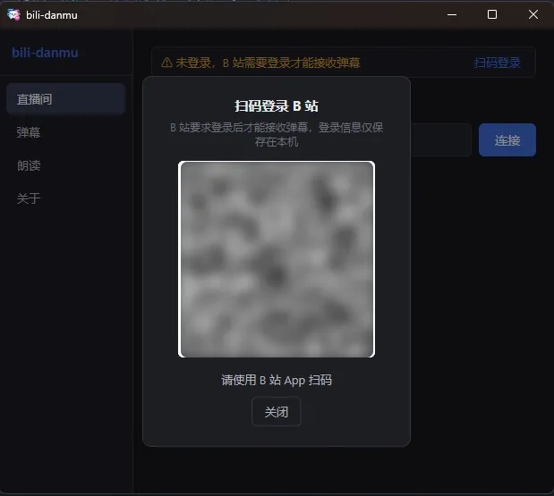
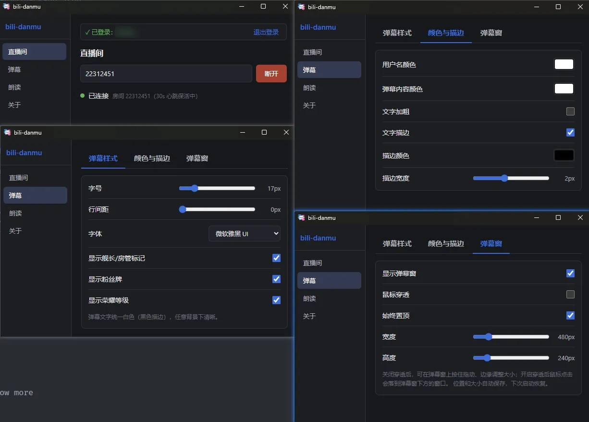

<p align="center"></p>

# bili-danmu

轻量级 B 站直播弹幕助手

> 连接 B 站直播间 → 获取实时弹幕 → 在桌面透明悬浮层显示，支持发送弹幕与 Edge TTS 朗读。

## 开发背景

- 以前在用的弹幕助手早已停更，B 站弹幕协议更新后已无法正常接收弹幕。
- 现存的弹幕助手基于臃肿的桌面框架，体积大、资源占用高，不够轻量。
- 因此重写本项目：给用 OBS 推流的主播一个不挡游戏画面的看弹幕窗口，也给想和主播一起玩、一起互动的水友一个干净的看弹幕工具。
- 感谢开源社区：弹幕协议相关接口的公开分析与实现，以及 [DanmuFree](https://github.com/SoraYjy/DanmuFree) 的开源参考。

## ✅ 已完成 vs 🔜 未完成

### B 站连接

| 功能 | 状态 |
|---|---|
| WebSocket 弹幕链路（认证包 protover=3、Brotli/Zlib 解压、DANMU_MSG 解析） | ✅ |
| WBI 签名 + getDanmuInfo（getConf 兜底）获取弹幕服务器 | ✅ |
| 30s 心跳保活 | ✅ |
| 扫码登录（二维码轮询 + Cookie 本地持久化 + 昵称显示） | ✅ |
| 未登录收弹幕 | ❌ B 站不支持（2025+ 不向游客推送 `DANMU_MSG`，游客级 token 只能连上、收不到弹幕，必须扫码登录） |
| 断线自动重连（1/2/4/…/30s 退避，10 次上限后报错） | ✅ |
| 发送弹幕（msg/send 协议 + bili_jct CSRF 签名，需登录） | ✅ |
| 礼物/SC/舰队等事件解析、礼物区渲染与礼物朗读（见下方「礼物系统」） | ✅ |

<p align="center"></p>

### 弹幕显示（Overlay）

| 功能 | 状态 |
|---|---|
| 桌面透明悬浮层：透明背景、无边框、可置顶、可拖动、可调整大小 | ✅ |
| 鼠标穿透开关 | ✅ |
| 窗口位置/大小自动记忆，重启恢复 | ✅ |
| 弹幕样式：字号 / 字体族 / 用户名颜色 / 内容颜色 / 粗体 / 描边（颜色 + 宽度） | ✅ |
| 身份徽章独立开关：舰长 / 提督 / 总督 / 房管 / 粉丝牌 / 荣耀等级 | ✅ |
| 徽章排版对齐：固定身份前缀列，LV 徽章与换行续行各行同列对齐 | ✅ |
| 弹幕行间距可调（0–30px 滑块，实时生效并保存） | ✅ |
| 弹幕窗顶部透明拖拽条：鼠标移入即提示，弹幕高速刷新也能稳定拖动 | ✅ |
| 长文本弹幕换行与首行正文同列（不贴窗口左缘） | ✅ |
| 弹幕数量上限（120 条，超出移除最早）防内存无限增长 | ✅ |
| 弹幕 / 礼物入场动画：淡入 + 向上浮现 160ms（只走合成层，高频不降级） | ✅ |
| 滚动弹幕模式（右→左） | 🔜 未做（当前为列表流式） |
| 顶弹模式 | 🔜 未做 |
| 弹幕过滤：只显示舰长 / 房管、有粉丝牌、荣耀等级 ≥ 自定义值的弹幕（多条开启时任一命中即显示） | ✅ |
| 敏感词屏蔽：命中词表整条丢弃（舰长/房管不豁免），Overlay 实时生效、持久化 | ✅ |
| 用户屏蔽（拉黑指定用户名） | 🔜 未做 |
| 连接状态 / 系统提示行（与弹幕同字体同描边） | ✅ |
| 独立发送弹幕框：透明悬浮、始终吸附弹幕窗下方、回车发送、字号跟随弹幕 | ✅ |

<p align="center"></p>

### TTS 朗读

| 功能 | 状态 |
|---|---|
| Edge TTS 引擎（自研直连微软 Read Aloud WebSocket，无 Python / 无 SDK 依赖） | ✅ |
| 播放串行队列 + 队列长度限制（超出丢弃最旧，防刷屏） | ✅ |
| 合成/播放流水线（播第 N 条时预合成第 N+1 条） | ✅ |
| 积压时丢弃待播旧弹幕（在播的那条念完，带 1.8s 打断冷却） | ✅ |
| 语速 / 音量 / 音色选择（14 个中文音色：普通话 / 方言 / 粤语 / 台湾，可从微软刷新列表） | ✅ |
| 试听当前设置（不受总开关限制） | ✅ |
| 朗读内容清洗（emoji / 链接 / 会念出名字的符号如 `_` / 重复字符折叠 / 正文截断） | ✅ |
| 无内容弹幕整条跳过（纯标点、纯 emoji、纯链接不会再念出一句「小明说」+ 静音） | ✅ |
| 朗读文案开关：念用户名、念身份前缀（房管 / 舰长），昵称同样过清洗 | ✅ |
| 朗读筛选（与弹幕显示筛选各自独立）：舰长/房管、粉丝牌、荣耀等级、敏感词 | ✅ |
| 礼物朗读（见下方「礼物系统」）：高优先级插队、连击窗口结束后汇总、独立开关与门槛 | ✅ |
| Windows 系统 TTS 引擎（离线兜底） | 🔜 未做 |

> 朗读与显示是两个独立消费者：关掉朗读不影响弹幕窗，关掉弹幕窗仍可朗读。
> 延迟实测：握手 ~650ms + 合成首字节 ~230ms 是每条固定开销，音频时长 (~0.21s/字) 才是真瓶颈，
> 故默认「正文最多 15 字 + 积压时丢弃旧弹幕」。B 站弹幕上限 30–40 字 ≈ 7–9s，`max_len = 0` 也不会失控。
> 协议细节与实测数据可用 `scripts/edge-tts-probe.ps1` 复现。

<p align="center"></p>

### 产品化

| 功能 | 状态 |
|---|---|
| 系统托盘（关闭隐藏主窗、左键唤出、右键菜单退出） | ✅ |
| 退出登录自动断开直播连接 | ✅ |
| 配置持久化（`%APPDATA%\com.bilidanmu.app\config.json`，JSON） | ✅ |
| 关于页：软件版本号、致谢弹幕协议 API 与 DanmuFree 开源参考 + 项目地址一键复制 + 微信赞赏码 | ✅ |
| 最近房间面包屑（保留最近 10 个直播间与主播名，点击直连） | ✅ |
| 主界面直播间页底部状态仪表盘（弹幕窗显隐/穿透/置顶、弹幕速率、朗读开关与筛选条件，只读展示） | ✅ |
| 单实例 | 🔜 未做 |
| 全局快捷键（显示/隐藏、TTS、穿透） | 🔜 未做 |
| 开机自启 / 启动自动连接上次房间 | 🔜 未做 |
| 统一日志系统 | 🔜 未做 |
| Release 打包与发布（NSIS 安装包 2.8MB） | ✅ 已发 v1.0.0 |

### 礼物系统（进行中）

打赏事件已接入显示链路：弹幕窗内一块独立的礼物区，位于弹幕列表上方，
只收录付费打赏（银瓜子等免费礼物不进列表），金额门槛与连击合并都在 Rust 侧判定。

| 功能 | 状态 |
|---|---|
| 事件解析：`SEND_GIFT` / `COMBO_SEND`（连击礼物）/ `SUPER_CHAT_MESSAGE`（SC）/ `GUARD_BUY`（上舰） | ✅ |
| 事件模型扩充：`BilibiliEvent` 新增 `Backing` 变体，金额统一折算为分 | ✅ |
| 弹幕窗渲染：礼物区独立列表（弹幕区上方），礼物行沿用弹幕徽章列（不显示粉丝牌）与样式、金色区分 | ✅ |
| 金额门槛（默认 0 元 = 全部付费打赏）与连击合并（同人同礼物窗口内累加，位置不变） | ✅ |
| 设置项：「主播分区 → 礼物渲染」标签（开关 / 门槛 / 条数上限 / 合并窗口） | ✅ |
| 礼物图标（需下载 B 站 CDN 图片并缓存） | 🔜 未做，渲染层已留扩展位 |
| 礼物朗读：接入现有 Edge TTS 队列，`GiftTtsConfig` 独立开关与金额门槛 | ✅ |
| 礼物朗读插队：排到待朗读弹幕之前（当前这条念完，不掐断半句） | ✅ |
| 礼物朗读文案：感谢 + 用户名 + 数量 + 礼物名；SC 念留言正文（超 50 字截断）；上舰念档位 | ✅ |
| 礼物朗读连击汇总：静默满一个连击窗口念一次（窗口沿用礼物渲染的配置） | ✅ |
| 设置项：「主播分区 → 礼物朗读」标签（开关 / 门槛） | ✅ |
| 欢迎信息：进房观众 / 上舰 / 关注点赞的欢迎消息 | 🔜 未做 |

> `COMBO_SEND` 只当「连击仍在继续」的信号用（延长合并窗口），数量与金额一律以 `SEND_GIFT` 为准，
> 避免连击期间两路事件重复计数。其是否携带价格字段尚未实测，可用 `scripts/ws-probe.ps1` 验证。
>
> 礼物朗读与礼物列表各自判定（不共用状态）：渲染侧只在过渲染门槛时才产出累计行，
> 朗读门槛与它独立，所以朗读自己按「用户 + 礼物」再累加一遍；礼物区关掉、弹幕朗读关掉，礼物朗读照常工作。

<p align="center"></p>

## 快速开始

> 只想用不想编译：到 [Releases](https://github.com/bd-dxg/bili-danmu/releases/latest) 下载安装包（`bili-danmu_x.y.z_x64-setup.exe`）双击安装即可。

环境要求（从源码构建）：Node.js ≥ 20、pnpm、Rust toolchain（MSVC）、WebView2 Runtime（Win10/11 自带）。

```bash
pnpm install
pnpm tauri dev
```

启动后：

1. 扫码登录（**必做**：B 站 2025+ 不向游客推送弹幕，未登录收不到弹幕；登录后还会显示昵称）
2. 输入直播间号，点「连接」（也可点输入框下方的面包屑直连最近房间）
3. 弹幕实时显示在桌面透明悬浮窗；设置页可开鼠标穿透，让鼠标点击落到弹幕窗下方的窗口
4. 在弹幕窗下方的发送框输入文字，回车发送
5. 想听弹幕：到朗读页开启开关、选音色，点「试听」调好语速音量再挂后台

## 技术栈

```text
Frontend   Vue 3 + TypeScript + Vite
Desktop    Tauri 2
Core       Rust（B 站协议 / WS / 登录 / 发送弹幕 / TTS / 窗口控制 / 配置）
Platform   Windows（透明窗口、托盘）
```

- Rust 负责：B 站连接、WebSocket、协议解析、登录、发送弹幕、Edge TTS 朗读、窗口控制、配置持久化
- Vue 负责：设置界面（弹幕样式 / 弹幕窗控制 / 朗读配置）、悬浮窗弹幕渲染、发送弹幕框、状态展示

## 架构

```text
┌───────────────────────┐
│       Vue 3 UI        │  设置界面 / 悬浮窗渲染 / 发送框 / 状态
└──────────┬────────────┘
           │ Tauri IPC
┌──────────▼────────────┐
│      Rust Core        │
│  bilibili(HTTP + WS)  │
│  tts(Edge TTS + 队列)  │
│  state / commands     │
│  connection / window  │
│  config               │
└──────────┬────────────┘
           ▼
      Windows API
```

- 弹幕事件流：B 站 WS → Rust 解析 → ①`danmaku` 事件 → Vue Overlay 渲染　②TTS 筛选/清洗 → 合成 → 队列播放
  （两个消费相互独立：关掉朗读不影响弹幕窗，关掉弹幕窗仍可朗读）
- 连接状态双通道：主窗口订阅 `room-status` 事件；悬浮窗额外每 2s 轮询 `get_connection_status` 兜底防事件丢失
- 断线自动重连在 `connection.rs`：1/2/4/…/30s 退避、10 次上限，重连期间前端保持「已连接」语义不闪断

## 配置与数据

- 配置目录：`%APPDATA%\com.bilidanmu.app\config.json`
- 保存内容：登录 Cookie（含昵称）、Overlay 弹幕样式与行距、Overlay 窗口位置/大小、弹幕过滤规则（身份开关、荣耀阈值、敏感词表）、TTS 配置（开关/音色/语速/音量/文案开关/队列上限/朗读筛选）、礼物列表配置（开关/门槛/条数/合并窗口）、礼物朗读配置（开关/门槛）、最近房间列表（上限 10 条）
- 登录 Cookie 落盘前经 **Windows DPAPI 加密**（绑定当前用户与机器）：配置文件被拷贝到其它机器/账户后无法解密，需重新扫码登录；内存态保持明文供请求使用
- 数据仅存本机，不收集遥测、不上传日志
- 例外：开启弹幕朗读或礼物朗读后，弹幕正文 / 打赏文案会发往微软 Edge TTS 服务（`speech.platform.bing.com`）用于合成语音；关掉对应开关即不再发送（音色列表刷新同样会访问该服务）

## 里程碑

| 里程碑 | 内容 | 状态 |
|---|---|---|
| M1 | Tauri + Vue + Rust 脚手架、IPC | ✅ |
| M2 | B 站弹幕链路（WS + WBI + 扫码登录） | ✅ |
| M3 | Overlay 悬浮窗（透明/穿透/置顶/拖动/记忆位置/拖拽条） | ✅ |
| M4 | 弹幕渲染 + 样式配置（字号/描边/行距）+ 数量限制 + 徽章对齐 | ✅ |
| 定制扩展 | 托盘 / 退出登录断连 / 桌面 logo | ✅ |
| 界面优化 | 弹幕页标签化、悬浮窗设置并入、昵称显示、关于页 | ✅ |
| M5 | TTS 朗读（Edge TTS 引擎 + 队列 + 清洗 + 筛选） | ✅（系统 TTS 未做） |
| M6 | 自动重连 / 打包发布 / 单实例 / 快捷键 / 日志 | 🔜 部分（自动重连 ✅、打包发布 ✅，其余未做） |
| 弹幕过滤 | 身份白名单（舰长/房管、粉丝牌、荣耀等级≥N）+ 敏感词屏蔽 | ✅ |
| 发送弹幕 | 独立悬浮发送框（吸附弹幕窗下方、左端与弹幕区齐平、宽度取弹幕区 80%、回车发送）+ msg/send 协议 | ✅ |
| 界面补全 | 最近房间面包屑、运行状态仪表盘、关于页项目地址 | ✅ |
| 代码整理 | 9 个超 300 行的文件按职责拆分（行为不变） | ✅ |
| 1.0.0 发布 | 版本号升至 1.0.0，NSIS 安装包 2.8MB 发布到 Releases | ✅ |
| 关于页增强 | 软件版本号徽章 + 微信赞赏码 | ✅ |
| 检查更新 / 自动更新 | Tauri updater（待做：签名密钥、端点到 latest.json、capabilities 授权） | 🔜 未做 |

## 项目结构

```text
src/                    Vue 前端
├── views/              主窗页面（直播间 / 弹幕 / 朗读 / 关于，后三者均为页内标签式）
├── components/         登录弹窗、筛选表单（显示/朗读共用）、状态仪表盘、设置行、弹幕窗标签页
├── composables/        登录态 / 连接与最近房间 / 朗读配置与音色 / 设置页提示
├── overlay/            悬浮层入口 + 单行弹幕渲染（独立入口）
├── sender/             发送弹幕框（独立入口）
├── styles/             全局设置页样式
└── types/ipc.ts        Rust ↔ Vue 共享类型

src-tauri/src/          Rust 核心
├── lib.rs              组装：状态托管 / 窗口创建 / 托盘 / 命令注册
├── state.rs            内存状态（连接状态机、速率窗口、Overlay 状态）
├── commands.rs         IPC 命令
├── connection.rs       连接、断线重连与收尾竞态
├── window.rs           窗口句柄、发送框吸附、位置落盘
├── bilibili/           HTTP 接口 / WebSocket 会话 / 封包协议 / 解析 / WBI / 登录 / 发送
├── tts/                队列状态 / 文案清洗 / 合成播放流水线 / MP3 播放（winmm MCI）
│   └── edge/           Edge TTS 协议、音色表、SSML、时间与编码工具
└── config/             配置读写、结构体、DPAPI 加解密
```

## License

本项目以 [GNU GPL v3](LICENSE) 开源。

实现参考了 [DanmuFree](https://github.com/SoraYjy/DanmuFree)（MIT License © SoraYjy），其协议与 WBI 签名实现源自该项目，特此声明致谢。


